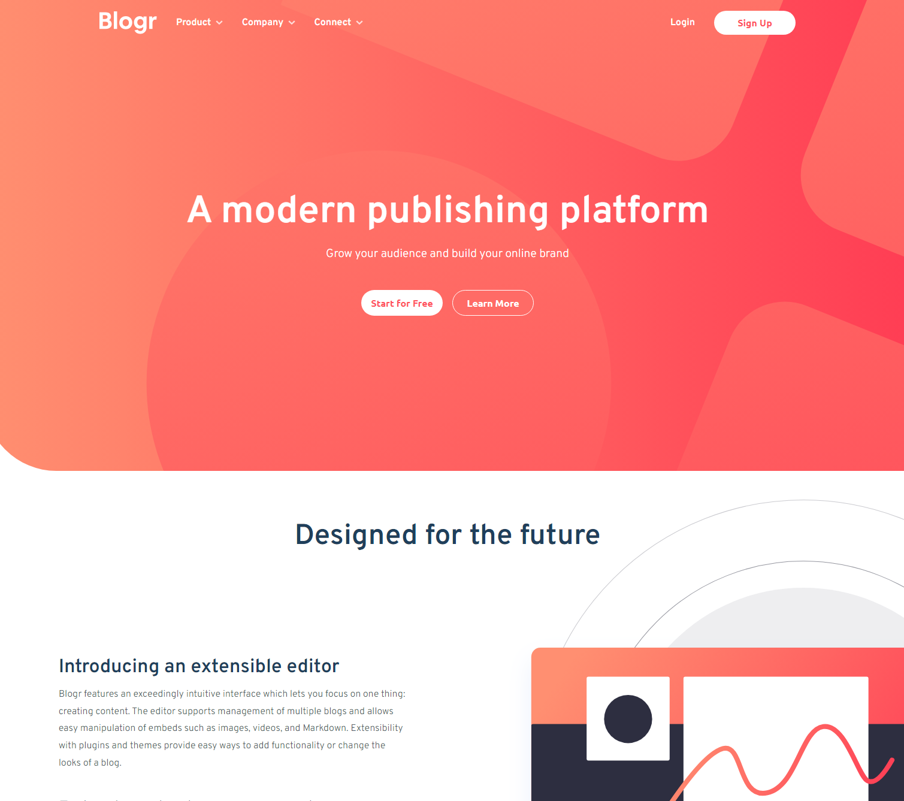

# Frontend Mentor - Blogr landing page solution

This is a solution to the [Blogr landing page challenge on Frontend Mentor](https://www.frontendmentor.io/challenges/blogr-landing-page-EX2RLAApP). Frontend Mentor challenges help you improve your coding skills by building realistic projects.

## Table of contents

- [Overview](#overview)
  - [The challenge](#the-challenge)
  - [Screenshot](#screenshot)
  - [Links](#links)
- [My process](#my-process)
  - [Built with](#built-with)
  - [What I learned](#what-i-learned)
  - [Continued development](#continued-development)
  - [Useful resources](#useful-resources)
- [Author](#author)

## Overview

### The challenge

Users should be able to:

- View the optimal layout for the site depending on their device's screen size
- See hover states for all interactive elements on the page

### Screenshot

### Links

- Github URL: [Github URL](https://github.com/exchyphen/fm_blogr-landing-page)
- Live Site URL: [live site hosted by Github Pages](https://exchyphen.github.io/fm_blogr-landing-page/)

## My process

### Built with

- HTML
- CSS
- JavaScript

### What I learned

Attempted to use BEM for CSS naming. I want to continue trying BEM and maybe another naming convention to further organize my code.

### Continued development

May look into restructuring the general HTML, it turned out messier than I originally planned on.

### Useful resources

- [BEM](https://getbem.com/introduction/) - Introduction and information about BEM methodology.

## Author

- Github - [exchyphen](https://github.com/exchyphen)
- Frontend Mentor - [@exchyphen](https://www.frontendmentor.io/profile/exchyphen)
